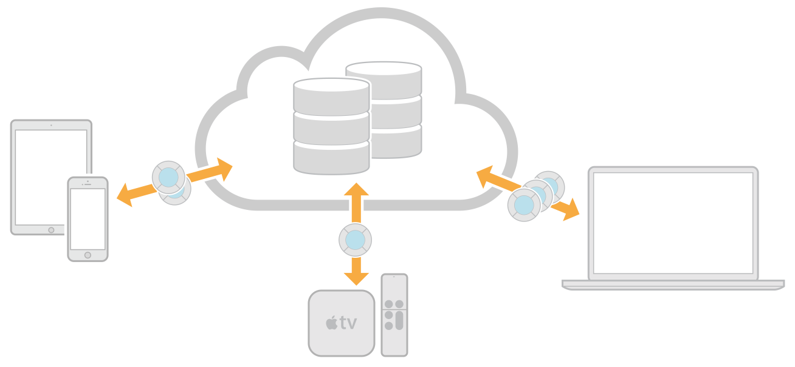
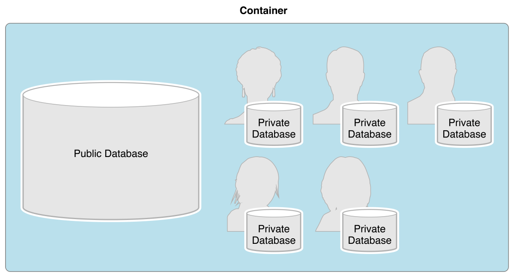
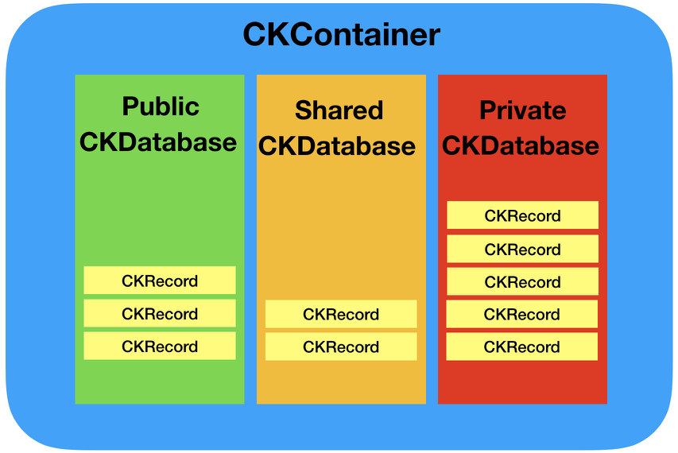
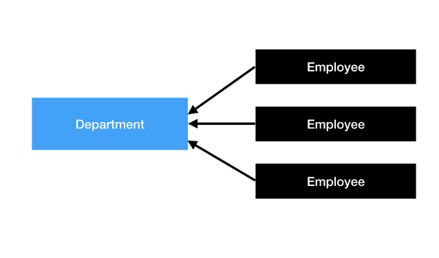

build-lists: true

# [fit]CloudKit

## [fit]What is CloudKit?
- Apple's backend solution.
- Powers iCloud.
- Some cool apps using it, like Things 3.
- Backend without having to set one up.
- Passes cost on to the user.
- Easy Authentication & Setup.

---

##  [fit]Parts of CloudKit

--- 

## [fit]CKContainer
- There is one default CloudKit Container per app.
- The default container's identifier matches that of the app's bundle id.
- Apps can have multiple containers and apps can share containers with other apps by the same developer.

## [fit]CKDatabase

- CKDatabase objects are children of CKContainer objects.
- Each container holds multiple databases.
- They have a public database accessible to all users. (Readonly for users not signed in to iCloud).
- Your app can also read/write to the user's private database. (Requires active iCloud account).

## More...
- Private data is not visible to developers in the dashboard.
- New in iOS 10 is the "shared database". (Requires active iCloud account).
- The shared database, like the private database, is not visible in the dashboard to developers.
- Shared data access is controlled by an `CKShare` object.
- Users are on the hook for private data storage, which is good for developers. [Cost details](https://developer.apple.com/icloud/cloudkit/).

---

---

## [fit]CKRecord

- CKRecords are children of CKDatabase objects.
- Think of them as corresponding to database rows.
- These records are essentially key-value dictionaries.
- Data types are limited to: `NSString`, `NSNumber`, `NSData`, `NSDate`, `NSArray`, `CLLocation`, `CKAsset`, `CKReference`.
- `NSData` should only be used for binary data of a few kilobytes.
- Use `CKAsset` for binary files that are larger than a few kilobytes.

--- 
- `CKReference` creates a backlink to related record by storing the id of the target object.
- `CKReference` supports cascade deletion.
- 1 to many relationships are supported.
- A single record is limited to 750 references.
- Records require a zone (CKRecordZone).
- If you don't assign a zone then the default zone will be used.
- CKRecordZones are used to further encapsulate data. (Be careful).

---

## [fit]CKQuery

- Used to control you fetch operations.
- Can only be used with a single RecordType.
- You make a CKQuery using `NSPredicate`. Full `Predicate` construction isn't supported. (Check the documentation).
- Set `NSPredicate` with a value of `true` to get all records.
- CKQuery also takes an optional `NSSortDescriptor` array.

## [fit]Authentication
- If your user is logged into iCloud they are authenticated!
- If not, they can only read the public db.
- Always check that users are logged into iCloud and warn them of limited functionality if they aren't.
- Call `accountStatus(completionHandler:)` on the container to determine whether the user is logged in.
- Your app should sign up to receive `CKAccountChanged` notifications.

## [fit]CKReference

- Used to create a many-to-one relationship between records in a database.
- A reference stores information about the one record that is the target of the reference.
- The reference object is saved in the fields of one or more records to create a link from those records to the target. 
- Both records must be located in the same zone.

---

- For instance, let's say our employee has a department. 
- Make a `CKReference` out of a `department` record.
- `department` is the target object. 
- We then add this reference (backlink) to any employee objects that are in that department.
- When creating a CKReference we have to specify the "delete policy". 
- If the target object is deleted (department in our example) does this remove all employees in that department or not?

---

---

## [fit]Convenience Vs Operations API

- There are 2 API's: Convenience, Operations.
- CloudKit Operations derive from `(NS)Operation`.
- Operations let you batch fetches and changes.
- Operations are highly configurable. Eg. (dis)allow cellular, fetch partial records, limit result set, progress reporting, determining priority, etc.

## [fit]Operations

## [fit]`CKQueryOperation`

- Used when you have a lot of data.
- `CKQueryOperation` is used for performing fetches and allows you to specify a result size, to permit paging, and get progress.
- Since `CKOperation` inherits from `NSOperation` you may have to look at the `NSOperation` class to figure out how to use it.

## [fit]`CKModifyRecordsOperation`

- An operation that saves changes to one or more record objects.
- Used for add, update, delete operations.
- The `savePolicy` determines how you want to handle conflicting data.
- Modify operations can be marked `isAtomic` if we want all operations to fail if any single record fails. (`true` default)
- Assign a completion block to handle callbacks.

## [fit]Demo

## [fit]Push Notifications
- No encryption key setup required.
- Push notifications can be silent or not.
- Silent notifications do not require user authorization. Just call `registerForRemoteNotifications` on `UIApplication`.
- Push notifications can only be received on a real device.
- Uses UNUserNotification API!

## [fit]CKSubscription
- You can subscribe to data changes to receive push notifications!
- Only create a CKSubscription once. (You can store this in `UserDefaults`)
- These can run silently and wake the app in the background to update data.
- Typically you will fetch when you're notified about changes.

---
## More...
- To receive push notifications as silent set the `CKNotificationInfo` instance to `shouldSendContentAvailable` to `true`.
- `CKDatabaseSubscription` (iOS 10+) only works on private + shared databases and allows you to be notified of changes across the db.
- Make sure to set the `notificationInfo` property on the subscription instance.

--- 
## More...
- Use the `application(_: didReceiveRemoteNotification: fetchCompletionHandler:)` to receive your notification callback.
- Inside the completion handler pass the userInfo key to a `CKNotification(fromRemoteNotificationDictionary:)` in order to check the `subscriptionID`.

---

## [fit]Push Demo

## References

* [CloudKit Starter Documentation](https://developer.apple.com/icloud/cloudkit/)
* [CloudKit Best Practices WWDC](https://developer.apple.com/videos/play/wwdc2016/231)